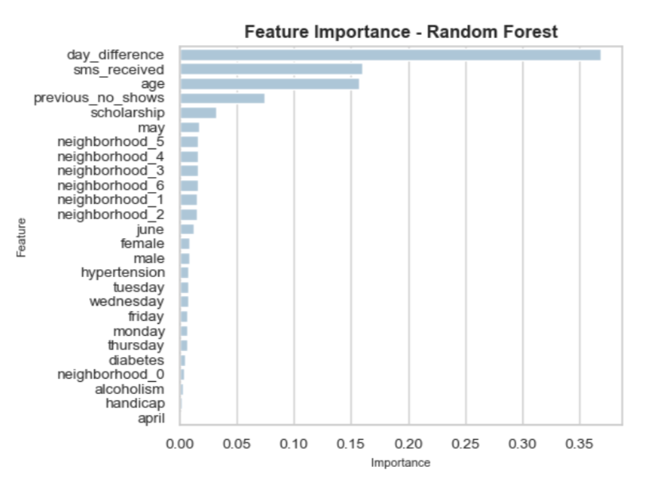

# Predicting Medical Appointment No-Shows With Machine Learning

Analyzing medical appointment data from Brazil's Greater Vitória metropolitan area to predict patient no-shows. This project employs descriptive and predictive analytics to identify key factors influencing patient attendance, ultimately aiming to inform and improve healthcare delivery processes. All steps in the data pipeline can be viewed in this repository's **data_cleaning_and_exploration.ipynb** and **data_preprocessing_and_model_training**.

## Dataset Description
The raw dataset (**data/raw_medical_appointment_data.csv**) contains 110,527 entries of patient appointment records from 2016, capturing a range of attributes that may impact attendance.

- **PatientId**: A unique identifier for each patient in the dataset.
- **AppointmentID**: A unique identifier for each appointment scheduled.
- **Gender**: The gender of the patient (e.g., 'F' for female, 'M' for male).
- **ScheduledDay**: The date and time when the appointment was scheduled, in the format YYYY-MM-DD HH:MM.
- **AppointmentDay**: The date of the scheduled appointment in the format YYYY-MM-DD.
- **Age**: The age of the patient in years.
- **Neighbourhood**: The neighborhood where the patient resides, represented as a categorical variable.
- **Scholarship**: A binary feature representing whether the patient has a scholarship (government subsidy).
- **Hipertension**: A binary feature representing whether the patient has hypertension.
- **Diabetes**: A binary feature representing whether the patient has diabetes.
- **Alcoholism**: A binary feature representing whether the patient has a history of alcoholism.
- **Handcap**: An integer indicating the number of handicaps a patient has, ranging from 0 to 4.
- **SMS_received**: A binary feature representing whether the patient received an SMS appointment reminder.
- **No-show**: A categorical target variable indicating whether the patient did not show up for the appointment ('Yes' for no-show, 'No' for attended).

## Data Cleaning and Exploration

### Chronological Trends

No appointments occurred on Sundays, and very few took place on Saturdays. Since we remove Saturday appointments from the dataset, there is no weekday versus weekend relationship to explore. However, a higher no-show rate is observed for Friday appointments compared to any other day, as illustrated in the associated bar chart. 

Appointments primarily occurred in May and June, with a couple of thousand taking place in April. The difference in days between when the appointment was scheduled and when it took place is heavily right-skewed. The lower 75% of this feature are concentrated between 0 and 15 days, indicating that appointments were often scheduled to address specific and urgent patient issues. Conversely, the upper 25% of appointments show a day difference ranging from 15 to 179 days, suggesting less urgent concerns or routine checkups.

Notably, no-show appointments include significantly more instances with large day differences compared to attended appointments, as indicated by the associated violin plot.

### Primary Patient Attributes

The female-to-male patient ratio in this dataset is nearly 2:1. This discrepancy may result from how the data was collected or suggest that female patients in the area are seeking appointments more frequently than their male counterparts.

Patient age is slightly right-skewed, with a significant number of patients close to age 0. This is likely due to mothers scheduling appointments for their newborns, whose ages are recorded in the dataset. The quartiles for patient age are as follows: 18 years (first quartile), 37 years (second quartile), and 55 years (third quartile), indicating a diverse patient population across various stages of human development.

An examination of the neighborhoods included in this dataset reveals 79 unique areas. The most populous neighborhoods account for thousands of appointments, while the least populous have fewer than 50 appointments.

### Other Patient Attributes

The scholarship designation indicates that a patient or family has a low income and is receiving government subsidies, comprising less than 10% of the dataset entries. Patients with scholarships exhibit a higher no-show rate compared to their counterparts.

In contrast, conditions such as hypertension, diabetes, and alcoholism are associated with slightly lower no-show rates when compared to patients without these attributes. The correlation between the number of handicaps a patient has and the no-show rate is unclear, likely due to the small number of patients with two, three, or four handicaps.

Additionally, receiving an SMS notification for an appointment is linked to a lower overall likelihood of not showing up. Notably, while many patients have missed one or more previous appointments, it is unusual to find instances of patients who have missed between 20 to 57 appointments.

### Feature Correlation

The correlation matrix of the cleaned dataset reveals several interesting relationships among the features. As expected, hypertension, diabetes, and age exhibit a high degree of correlation with one another. Additionally, the columns for day_difference and sms_received show a substantial correlation; having sufficient time before an appointment enables the timely dispatch of SMS notifications.

## Data Preprocessing and Model Training

To maintain a streamlined process, dataset features were preprocessed once for use in predictive analytics. Preprocessing included encoding discrete variables and transforming/scaling continuous features, whether or not necessary for each model. Subsequently, three different machine learning models were trained and tested on the medical appointments dataset. Below is a breakdown of each relevant model, along with a summary table of test metric results. The table includes metrics achieved using a 0.5 classification threshold, but adjusting the threshold from that default value does increase or decrease various metrics-- notably precision and recall in an inverse manner.

### Logistic Regression

Chosen for its compatibility with binary output, the model was evaluated using k-fold cross-validation and grid search for hyperparameter tuning. The best logistic regression resulted from a C value of 100 and with L1 (Lasso) regularization. Finding a balance between all test metrics means choosing a threshold of 0.4 or 0.5.

### Deep Neural Network 

Employed as a more computationally intensive alternative, the deep neural network (DNN) was trained using stratified k-fold cross-validation. This DNN features two hidden layers and an output layer with a sigmoid activation function, appropriate for the binary target variable. The optimal model was chosen based on the F1 score. Despite not tuning its hyperparameters, the neural network's capacity to capture complex relationships in the data allowed it to achieve similar performance to logistic regression. However, at a given classification threshold, its precision was generally higher while recall was lower than its competitor. When the neural network predicts an appointment to be a no-show, it is highly likely to be correct. Nonetheless, its conservative approach to identifying such outcomes means that a significant number (essentially half) of the no-show appointments are not being classified as no-shows. Further hyperparameter adjustment could potentially enhance its performance.

### Random Forest

Trained as a model capable of binary classification, the random forest serves as a more robust version of the decision tree. Given that it has a larger number of hyperparameters to tune than logistic regression, random search with 10 iterations was employed to maintain an efficient training process. Increasing the number of iterations could be considered to extract any remaining improvements in test metrics. The best combination of hyperparameters found included 100 trees in the forest, a minimum of 5 samples for node splitting, at least 2 samples per leaf node, and a maximum tree depth of 30. Overall, the random forest's metrics are comparable to those of the other two models; summatively, it has slightly outperformed them due to achieving the highest F1 score and AUC-ROC. The AUC-ROC curve for this model features a strikingly vertical section: as the true positive rate increases from 0 to nearly 0.5, the false positive rate remains at 0. In this region of the curve, very conservative thresholds mean that the small number of appointments classified as no-shows are extremely certain to be actual no-shows.

| Model                | Accuracy | Precision | Recall | F1 Score | AUC-ROC |
|:---------------------|:--------:|:---------:|:------:|:--------:|:-------:|
| Logistic Regression   | 0.798    | 0.737     | 0.545  | 0.626    | 0.729   |
| Deep Neural Network    | 0.829    | 0.920     | 0.490  | 0.640    | 0.736   |
| Random Forest          | 0.838    | 0.908     | 0.531  | 0.670    | 0.753   |

## Project Significance

When comparing feature importances across the mentioned predictive models, several stand out. While the order of importance varies, the three most prominent features are the difference between the scheduled day and the appointment day, the previous number of patient no-shows, and whether a patient received an SMS notification. Scholarship reception and patient age also hold significance, although they hover below the top three factors. Depending on the model, the day of the week, gender, and neighborhood may also be mildly important.

In hindsight, many features derived from the initial dataset's columns proved to be the most significant, while patient attributes such as hypertension, diabetes, alcoholism, and handicap had little impact on predictions. The logistic regression, deep neural network, and random forest models demonstrated somewhat passable performance on this dataset; however, there is considerable room for improvement with a richer dataset. For instance, appointments spanning a longer time period (months or years) would provide more comprehensive insights. Additionally, incorporating data regarding the context and specifics of the appointment (type, purpose, attending practitioner, etc.) could enhance the model's predictive power. Including barriers to attendance, such as the patient's distance from the clinic and transportation access, as well as motivational factors and past reasons for no-shows, could significantly improve the accuracy of predictions.

Overall, these predictions can assist medical providers in their operational decision-making by identifying patients likely to no-show, and consequently, implementing proactive measures to improve appointment adherence. Understanding the factors influencing no-shows can guide resource allocation and scheduling strategies, ultimately leading to more efficient use of clinic time and enhanced patient care. In a broader context, this predictive capability can contribute to reducing healthcare costs and improving overall patient outcomes, as consistent attendance at medical appointments is crucial for effective treatment and management of health conditions.

  
  

